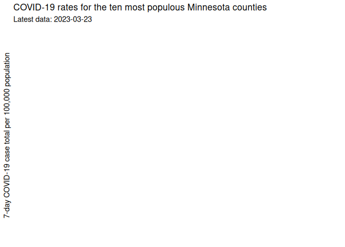
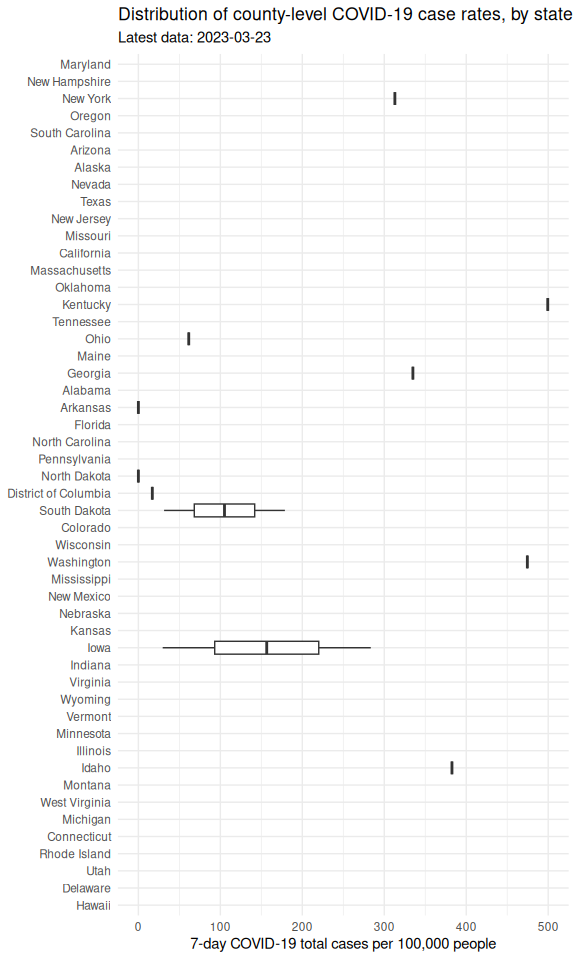

# Minnesota COVID Report


Report last run: 2026-01-14 04:06:57

## Introduction

EDITED BY DANI FREUND

This is an example report that uses COVID-19 data from the New York
Times to illustrate the use of automation processes.

First, we load some necessary libraries, define some key variables, then
read in the data:

``` r
library(dplyr)
library(ggplot2)
library(readr)
library(lubridate)
library(forcats)
library(knitr)

LAG_DAYS <- 7
POP_DENOM <- 100000

## County populations (read from a local data file in this repo)
pops <- read_csv("countypop_us.csv")

## COVID-19 case counts from the NYTimes (read from the web; updated daily)
county_data <- read_csv("https://raw.githubusercontent.com/nytimes/covid-19-data/master/us-counties-2023.csv")

rate_data <- county_data %>%
  select(date, state, county, cases) %>%
  mutate(date = ymd(date)) %>%
  left_join(pops, by = c("state", "county")) %>%
  group_by(state) %>%
  mutate(cases_lag = lag(cases, LAG_DAYS),
         totalcases_last = cases - cases_lag) %>%
  ungroup() %>%
  mutate(rate_last = totalcases_last / pop * POP_DENOM)
```

### Minnesota

Here is a plot of COVID-19 rates since Jan. 1, 2023 in the 10 most
populous Minnesota counties:

``` r
## Identify the top 10 most populous counties
top10_pop <- pops %>% filter(state == "Minnesota") %>%
  arrange(desc(pop)) %>%
  slice(1:10) %>%
  mutate(county = factor(county))

## Make the plot
rate_data %>%
    filter(state == "Minnesota", 
         county %in% top10_pop$county,
         date > Sys.Date() - 30) %>%
  ggplot(aes(x = date, y = rate_last, color = county)) +
  geom_line(linewidth = 2) +
  xlab(NULL) +
  ylab("7-day COVID-19 case total per 100,000 population") +
  scale_color_discrete(name = "") +
  theme_minimal() +
  ggtitle("COVID-19 rates for the ten most populous Minnesota counties", 
          subtitle = paste("Latest data:", max(rate_data$date)))
```



### United States

The following plot shows the distribution of current COVID-19 rates by
county for each state in the United States. The x-axis is truncated at a
7-day rate of 500 per 100,000 people for improved readability.

``` r
rate_data %>%
  filter(date == max(date),
         !is.na(rate_last)) %>%
  mutate(state = fct_reorder(factor(state), -rate_last, median, na.rm = TRUE)) %>%
  ggplot(aes(x = rate_last, y = state)) +
  geom_boxplot() +
  xlim(c(0,500)) +
  xlab("7-day COVID-19 total cases per 100,000 people") +
  ylab(NULL) +
  theme_minimal() +
  ggtitle("Distribution of county-level COVID-19 case rates, by state",
          subtitle = paste("Latest data:", max(rate_data$date)))
```



Here is a table of the 20 counties with the highest 7-day per 100,000
COVID-19 case rates:

``` r
rate_data %>%
  filter(date == max(date),
         !is.na(rate_last)) %>%
  arrange(desc(rate_last)) %>%
  select(county, state, pop, rate_last) %>%
  rename(covid_rate = rate_last) %>%
  mutate(covid_rate = round(covid_rate)) %>%
  slice(1:20) %>%
  knitr::kable()
```

| county             | state          |     pop | covid_rate |
|:-------------------|:---------------|--------:|-----------:|
| Delta              | Texas          |    5331 |     146989 |
| Nome Census Area   | Alaska         |   10004 |      68323 |
| Chattahoochee      | Georgia        |   10907 |      58183 |
| Rolette            | North Dakota   |   14176 |      54423 |
| Miami-Dade         | Florida        | 2716940 |      52763 |
| Bethel Census Area | Alaska         |   18386 |      51322 |
| Imperial           | California     |  181215 |      46528 |
| Scott              | Tennessee      |   22068 |      45858 |
| McKinley           | New Mexico     |   71367 |      44641 |
| Greenup            | Kentucky       |   35098 |      43877 |
| Burleigh           | North Dakota   |   95626 |      42409 |
| Stark              | North Dakota   |   31489 |      41846 |
| Craighead          | Arkansas       |  110332 |      40161 |
| Floyd              | Kentucky       |   35589 |      40029 |
| Whitley            | Kentucky       |   36264 |      39805 |
| Lexington          | South Carolina |  298750 |      39633 |
| Providence         | Rhode Island   |  638931 |      39570 |
| Nassau             | New York       | 1356924 |      39362 |
| Denali Borough     | Alaska         |    2097 |      38960 |
| Pike               | Kentucky       |   57876 |      38892 |
